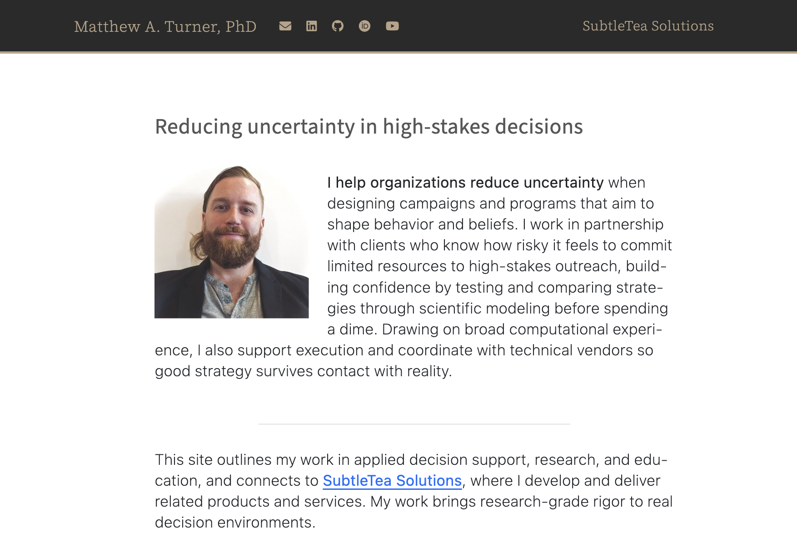

# Professional website.

Minimal professional website made using [Quarto](https://quarto.org/).

Easy to edit! Check _quarto.yml to customize the name and 
social connect buttons. 

In `_quarto.yml`, comment out the navbar block for SubtleTea Solutions
if you don't want to link to that page. This could be a good place for an
About page in place of a company page. If you want that, you can change the
SubtleTeaSolutions.qmd to be About.qmd, and change the "text" to be "About",
or customize that as desired.

## Screenshot

