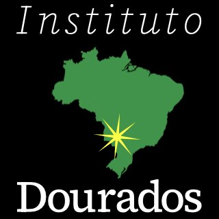
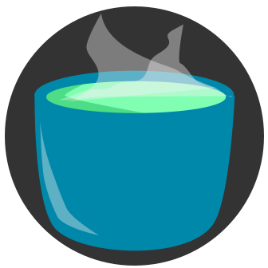
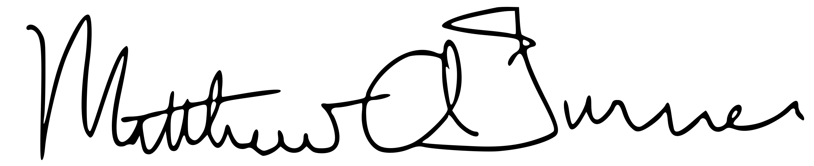

<h1 id=name>MAT, PhD Enterprises</h1>

<h2 id=tagline>Human-led democratic systems. Sustainable capacity.</h2>

 

MAT, PhD Enterprises build sustainable capacity through...

1. Translational research,
1. Multicultural and interdisciplinary education, and
3. Continuous adaptation to improve real-world outcomes.

### Generation of Participation in Democracy

My nonprofit, the [Generation of Participation in
Democracy - Américas](https://gpdamericas.org), builds capacity among
Indigenous and other marginalized peoples in the Américas and beyond. We develop
educational programs to prepare students of the Américas for local and
international capacity building.

Our translational research programs deploy custom tools to
make computing more accessible and powerful for public policy planning based
on rigorous principles of epidemiology and social science.

#### Instituto Dourados

_[Instituto Dourados](https://institutodourados.org)_ (i.e., the "Golden
Institute") is our first _Flagship Institute_. At Instituto Dourados we organize
researchers and students in an international exchnage program to boost autonomy
and effectiveness for Indigenous public health at the Dourados Indigneous
Reserve (_Reserva Indigena de Dourados_) in Dourados, Mato Grosso do Sul,
Brazil.

<!--  -->

### SubtleTea Solutions

[SubtleTea Solutions, LLC](SubtleTeaSolutions.qmd), is out to prove the claim
that sustainability can be a strategic advantage for businesses. Companies want
the most cost-effective solution, not the solution getting boosted the most on
social media.

Please [contact me](mailto:matt@subtleteasolutions.com) for custom software, hardware,
and organizational solutions backed by science. Investors and philanthropists
are invited and philanthropy opportunities. I created this website,
[https://mat.phd](https://mat.phd), and the others linked above.

- **My software portfolio** is represented by my GitHub profile:
  [mt-digital](https://github.com/mt-digital).
- **Follow me on [LinkedIn](https://linkedin.com/in/mt-digital) to stay
  updated about my work**. It really does support our work if you follow me, my
  organizations, and my colleagues.
- **Instagram:** for first looks at new Reels/Shorts and personal updates mixed in with
  professional ones, please follow me and share content on Instagram,
  [@matthewadamturnerphd](https://www.instagram.com/matthewadamturnerphd)

 

{.float-left height=225px}

<em>In solidarity and service,</em>

{width=200px}

<strong>Matt Turner, PhD</strong>

Founder & CEO

GPD Américas & SubtleTea Solutions

<a href="mailto:matt@mat.phd">Contact</a>
